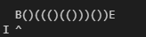
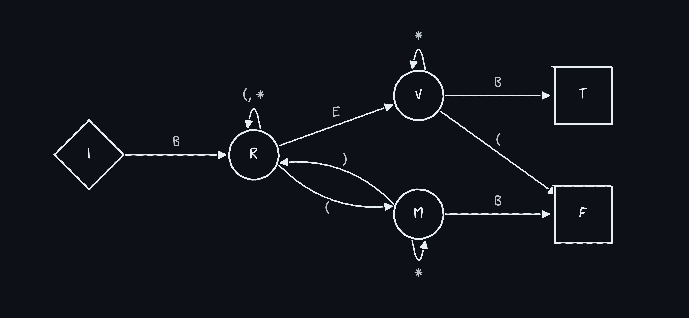

# Turing
---

This repo contains resources for translating a turing machine's description into a neural network that simulates it.

Translators available for
* [Statistically Meaningful Approximation: a Case Study on Approximating Turing Machines with Transformers](https://arxiv.org/abs/2107.13163)


## Example

Consider the balanced parentheses problem: we have a string of parentheses and want to determine if it is balanced. For example, "(())" is balanced whereas "())" is not.
We can determine whether a string is balanced using a Turing machine. Supposing the string is "()((()(()))())" we can write the Turing machine tape as "B()((()(()))())E",
where the symbols B, E indicate the beginning and ending positions on the tape.  The Turing machine has a *head* that starts at B and moves around the tape, reading and writing
symbols according to the rules of the machine. We show the head as a caret ^:
<p></p>

The machine also has a discrete internal state $z$. The letter on the bottom left (*e.g.* I, R, M, V) indicates the internal state.
The rules of the machine are specified by a *transition function* $\delta$,
so that, given the current state and symbol under the head, the following three actions are determined:
(1) the symbol to write at the current position;
(2) the next state;
(3) the direction to move the head (left or right).

We may represent $\delta$ as a directed graph, where the vertices are states and edges are symbols.

<p align="center">

</p>

The Turing machine halts when it reaches a *terminal state*. In this case, we have T - the string is balanced - or F - the string is not.

To simulate a Turing machine using a particular network, first specify the transition function (aka *delta*) and terminal states:
```
balanced_parentheses_delta = {
    ("I", "B") : ("R", "B",  1),
    ("R", "(") : ("R", "(",  1),
    ("R", ")") : ("M", "*", -1),
    ("R", "*") : ("R", "*",  1),
    ("R", "E") : ("V", "E", -1),
    ("M", "B") : ("F", "*", -1),
    ("M", "(") : ("R", "*",  1),
    ("M", "*") : ("M", "*", -1),
    ("V", "(") : ("F", "*", -1),
    ("V", "*") : ("V", "*", -1),
    ("V", "B") : ("T", "B",  1),
}

balanced_parentheses_terminal_states = ["T", "F"]
```
Then run
```
from turing.translators import Description, Translator
description = Description(balanced_parentheses_delta, balanced_parentheses_terminal_states)
maximum_steps = 100
tx = Translator(description, T=maximum_steps)
tape = "B()((()(()))())E"
tx.simulate(tape)
```
