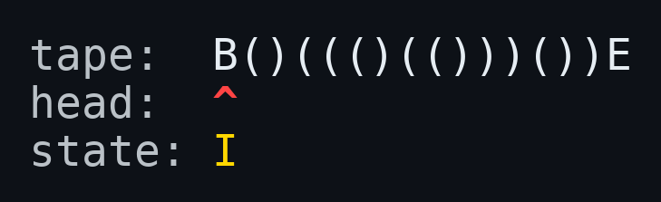
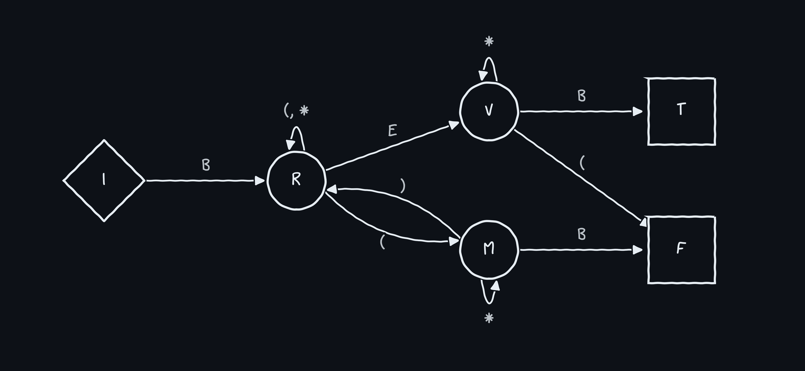

# Turing

Simulate Turing machines with neural networks. No training required. Weights are set analytically from the machine description.

Two simulators are available, each implementing a different theoretical result:

* **WCM**: [Statistically Meaningful Approximation: a Case Study on Approximating Turing Machines with Transformers](https://arxiv.org/abs/2107.13163) (Wei, C., Chen, Y., Ma, T.), transformer-style architecture [▶️ Example](#example-the-balanced-parentheses-problem)
* **SS**: [On the Computational Power of Neural Nets](https://www.sciencedirect.com/science/article/pii/S0022000085710136) (Siegelmann, H.T., Sontag, E.D.), recurrent architecture using stack machines [▶️ Start here](docs/STACK.md)

---

### 🚀 Quick Start

**Install**

```shell
git clone https://github.com/jonrbates/turing.git
cd turing
python3.12 -m venv .venv
source .venv/bin/activate
pip install --upgrade pip
pip install "torch>=2.1" --index-url https://download.pytorch.org/whl/cpu
pip install -e .
```

**Run the WCM simulator**

```python
from turing.wcm.simulator import Description, Simulator

# Description() defaults to the balanced parentheses machine
tx = Simulator(Description(), T=100)
tx.simulate("B()((()(()))())E")
```

---

### Example: The Balanced Parentheses Problem

We want to determine whether a string of parentheses is balanced; e.g. `"(())"` is balanced but `"())"` is not.

A Turing machine solves this by reading the tape `"B()((()(()))())E"` (where `B` and `E` mark the ends). The machine has a *head* that starts at `B` and moves left or right, reading and writing symbols according to its rules. The head position is shown as `^`:

<p></p>

The machine has a discrete internal state (I, R, M, V, T, F in the animation). Its behavior is fully defined by a *transition function* $\delta$: given the current state and symbol under the head, $\delta$ outputs (1) the symbol to write, (2) the next state, and (3) which direction to move.

We can visualize $\delta$ as a directed graph. States are vertices; edges are transitions. The initial state is a diamond; terminal states are squares.

<p align="center">

</p>

The machine halts when it reaches a terminal state (T = balanced, F = not balanced).

**Defining the transition function in Python:**

```python
transition_function = {
    ("I", "B") : ("R", "B",  1),
    ("R", "(") : ("R", "(",  1),
    ("R", ")") : ("M", "*", -1),
    ("R", "*") : ("R", "*",  1),
    ("R", "E") : ("V", "E", -1),
    ("M", "B") : ("F", "*", -1),
    ("M", "(") : ("R", "*",  1),
    ("M", "*") : ("M", "*", -1),
    ("V", "(") : ("F", "*", -1),
    ("V", "*") : ("V", "*", -1),
    ("V", "B") : ("T", "B",  1),
}

terminal_states = ["T", "F"]
```

Each entry maps `(state, symbol) → (next_state, write_symbol, direction)` where direction is `+1` (right) or `-1` (left).

**Simulating with the WCM neural network:**

```python
from turing.wcm.simulator import Description, Simulator

description = Description(transition_function, terminal_states)
tx = Simulator(description, T=100)
tape = "B()((()(()))())E"
tx.simulate(tape)
# prints each step and returns "T" (balanced) or "F" (not balanced)
```

`Simulator(description, T=100)` constructs a PyTorch model and analytically sets its weights to simulate the given Turing machine without any training. `T` is the maximum number of steps.

---

### 📓 Notebooks

The `notebooks/` directory contains interactive walkthroughs:

* `balanced_parentheses_part1.ipynb` - build the transition layer from scratch, step through the balanced parentheses problem
* `balanced_parentheses_part2.ipynb` - full WCM simulation, inspect the network's internal state at each step
