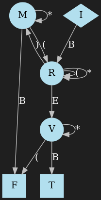

# Turing

Simulate turing machines with neural networks.


<details><summary>Quick Start</summary>

Step 1: clone this repo
```shell
git clone https://github.com/jonrbates/turing.git
```
Step 2: step into it
```shell
cd turing
```
Step 3: (optional but recommended) use a python environment
```shell
python3.8 -m venv .turing
source bin/activate/.turing
```
Step 4: install requirements
```shell
pip install requirements.txt
```
Step 5: open python
```shell
python
```
Step 6: create a simulator
```python
from TODO import TODO
```
Step 7: view the model
```python
TODO
```
Step 8: simulate the turing machine
```python
TODO
```
</details>


### Available Simulators

* [On the Computational Power of Neural Nets](https://www.sciencedirect.com/science/article/pii/S0022000085710136) (Siegelmann, H.T., Sontag E.D.) [▶️ Start Here](docs/STACK.md)
* [Statistically Meaningful Approximation: a Case Study on Approximating Turing Machines with Transformers](https://arxiv.org/abs/2107.13163) (Wei, C., Chen, Y., Ma, T.) [▶️ Start Here](#example)

---

### Example

Consider the balanced parentheses problem: we have a string of parentheses and want to determine if it is balanced. For example, "(())" is balanced whereas "())" is not.
We can determine whether a string is balanced using a Turing machine. Supposing the string is "()((()(()))())" we can write the Turing machine tape as "B()((()(()))())E",
where the symbols B, E indicate the beginning and ending positions on the tape.  The Turing machine has a *head* that starts at B and moves around the tape, reading and writing
symbols according to the rules of the machine. We show the head as a caret ^:
<p></p>

The machine also has a discrete internal state $z$, *e.g.* I, R, M, V in the animation. The rules of the machine are specified by a *transition function* $\delta$,
so that, given the current state and symbol under the head, the following three actions are determined:
(1) the symbol to write at the current position;
(2) the next state;
(3) the direction to move the head (left or right).

We may represent $\delta$ as a directed graph, where the vertices are states and edges are state transitions.
For example, if the machine is in state I and reads symbol B, then we traverse the edge
marked with B and see the next state is R.
For simplicity, we don't include the written symbol or movement direction in the graph.

<p align="center">

</p>

The Turing machine halts when it reaches a *terminal state*. In this example, we have terminal states T, F corresponding to "the string is balanced" or
"the string is not balanced", respectively.

To simulate a Turing machine using a particular network, first specify the transition function (aka *delta*) and terminal states:


```python
transition_function = {
    ("I", "B") : ("R", "B",  1),
    ("R", "(") : ("R", "(",  1),
    ("R", ")") : ("M", "*", -1),
    ("R", "*") : ("R", "*",  1),
    ("R", "E") : ("V", "E", -1),
    ("M", "B") : ("F", "*", -1),
    ("M", "(") : ("R", "*",  1),
    ("M", "*") : ("M", "*", -1),
    ("V", "(") : ("F", "*", -1),
    ("V", "*") : ("V", "*", -1),
    ("V", "B") : ("T", "B",  1),
}

terminal_states = ["T", "F"]
```

Then simulate the machine by running

```python
from turing.wcm.simulator import Description, Simulator
description = Description(transition_function, terminal_states)
maximum_steps = 100
tx = Simulator(description, T=maximum_steps)
tape = "B()((()(()))())E"
tx.simulate(tape)
```

That's all you need to do!

The line
```python
tx = Simulator(description, T=maximum_steps)
```
creates a neural network (a pytorch model) and initializes its parameters
to simulate the given turning machine description.

<details><summary>click to show model summary</summary>

```c#
WCMSimulator(
  (transition): Transition(
    (linear1): Linear(in_features=59, out_features=89, bias=True)
    (linear2): Linear(in_features=89, out_features=59, bias=True)
  )
  (preprocess_for_adder): PreprocessForAdder(
    (linear): Linear(in_features=59, out_features=66, bias=True)
  )
  (adder_layers): ModuleList(
    (0): FullAdder(
      (halfadder1): HalfAdder(
        (linear_or_and): Linear(in_features=66, out_features=66, bias=True)
        (linear_or_not): Linear(in_features=66, out_features=66, bias=True)
        (half_adder_final): Linear(in_features=66, out_features=66, bias=True)
      )
      (halfadder2): HalfAdder(
        (linear_or_and): Linear(in_features=66, out_features=66, bias=True)
        (linear_or_not): Linear(in_features=66, out_features=66, bias=True)
        (half_adder_final): Linear(in_features=66, out_features=66, bias=True)
      )
      (linear_or1): Linear(in_features=66, out_features=66, bias=True)
      (linear_or2): Linear(in_features=66, out_features=66, bias=True)
    )
    (1): FullAdder(
      (halfadder1): HalfAdder(
        (linear_or_and): Linear(in_features=66, out_features=66, bias=True)
        (linear_or_not): Linear(in_features=66, out_features=66, bias=True)
        (half_adder_final): Linear(in_features=66, out_features=66, bias=True)
      )
      (halfadder2): HalfAdder(
        (linear_or_and): Linear(in_features=66, out_features=66, bias=True)
        (linear_or_not): Linear(in_features=66, out_features=66, bias=True)
        (half_adder_final): Linear(in_features=66, out_features=66, bias=True)
      )
      (linear_or1): Linear(in_features=66, out_features=66, bias=True)
      (linear_or2): Linear(in_features=66, out_features=66, bias=True)
    )
    (2): FullAdder(
      (halfadder1): HalfAdder(
        (linear_or_and): Linear(in_features=66, out_features=66, bias=True)
        (linear_or_not): Linear(in_features=66, out_features=66, bias=True)
        (half_adder_final): Linear(in_features=66, out_features=66, bias=True)
      )
      (halfadder2): HalfAdder(
        (linear_or_and): Linear(in_features=66, out_features=66, bias=True)
        (linear_or_not): Linear(in_features=66, out_features=66, bias=True)
        (half_adder_final): Linear(in_features=66, out_features=66, bias=True)
      )
      (linear_or1): Linear(in_features=66, out_features=66, bias=True)
      (linear_or2): Linear(in_features=66, out_features=66, bias=True)
    )
    (3): FullAdder(
      (halfadder1): HalfAdder(
        (linear_or_and): Linear(in_features=66, out_features=66, bias=True)
        (linear_or_not): Linear(in_features=66, out_features=66, bias=True)
        (half_adder_final): Linear(in_features=66, out_features=66, bias=True)
      )
      (halfadder2): HalfAdder(
        (linear_or_and): Linear(in_features=66, out_features=66, bias=True)
        (linear_or_not): Linear(in_features=66, out_features=66, bias=True)
        (half_adder_final): Linear(in_features=66, out_features=66, bias=True)
      )
      (linear_or1): Linear(in_features=66, out_features=66, bias=True)
      (linear_or2): Linear(in_features=66, out_features=66, bias=True)
    )
    (4): FullAdder(
      (halfadder1): HalfAdder(
        (linear_or_and): Linear(in_features=66, out_features=66, bias=True)
        (linear_or_not): Linear(in_features=66, out_features=66, bias=True)
        (half_adder_final): Linear(in_features=66, out_features=66, bias=True)
      )
      (halfadder2): HalfAdder(
        (linear_or_and): Linear(in_features=66, out_features=66, bias=True)
        (linear_or_not): Linear(in_features=66, out_features=66, bias=True)
        (half_adder_final): Linear(in_features=66, out_features=66, bias=True)
      )
      (linear_or1): Linear(in_features=66, out_features=66, bias=True)
      (linear_or2): Linear(in_features=66, out_features=66, bias=True)
    )
    (5): FullAdder(
      (halfadder1): HalfAdder(
        (linear_or_and): Linear(in_features=66, out_features=66, bias=True)
        (linear_or_not): Linear(in_features=66, out_features=66, bias=True)
        (half_adder_final): Linear(in_features=66, out_features=66, bias=True)
      )
      (halfadder2): HalfAdder(
        (linear_or_and): Linear(in_features=66, out_features=66, bias=True)
        (linear_or_not): Linear(in_features=66, out_features=66, bias=True)
        (half_adder_final): Linear(in_features=66, out_features=66, bias=True)
      )
      (linear_or1): Linear(in_features=66, out_features=66, bias=True)
      (linear_or2): Linear(in_features=66, out_features=66, bias=True)
    )
    (6): FullAdder(
      (halfadder1): HalfAdder(
        (linear_or_and): Linear(in_features=66, out_features=66, bias=True)
        (linear_or_not): Linear(in_features=66, out_features=66, bias=True)
        (half_adder_final): Linear(in_features=66, out_features=66, bias=True)
      )
      (halfadder2): HalfAdder(
        (linear_or_and): Linear(in_features=66, out_features=66, bias=True)
        (linear_or_not): Linear(in_features=66, out_features=66, bias=True)
        (half_adder_final): Linear(in_features=66, out_features=66, bias=True)
      )
      (linear_or1): Linear(in_features=66, out_features=66, bias=True)
      (linear_or2): Linear(in_features=66, out_features=66, bias=True)
    )
  )
  (project_down): ProjectDown(
    (project_down): Linear(in_features=66, out_features=59, bias=True)
  )
  (indicate_visited_position): IndicateVisitedPosition()
  (binary_search_layers): ModuleList(
    (0): BinarySearchStep(
      (linear): Linear(in_features=59, out_features=59, bias=False)
    )
    (1): BinarySearchStep(
      (linear): Linear(in_features=59, out_features=59, bias=False)
    )
    (2): BinarySearchStep(
      (linear): Linear(in_features=59, out_features=59, bias=False)
    )
    (3): BinarySearchStep(
      (linear): Linear(in_features=59, out_features=59, bias=False)
    )
    (4): BinarySearchStep(
      (linear): Linear(in_features=59, out_features=59, bias=False)
    )
    (5): BinarySearchStep(
      (linear): Linear(in_features=59, out_features=59, bias=False)
    )
    (6): BinarySearchStep(
      (linear): Linear(in_features=59, out_features=59, bias=False)
    )
  )
  (get_last_written_symbol): GetLastWrittenSymbol(
    (linear): Linear(in_features=59, out_features=59, bias=False)
  )
  (get_initial_symbol): GetInitialSymbol()
  (get_v): GetV(
    (linear): Linear(in_features=59, out_features=59, bias=True)
  )
  (arrange_symbols): ArrangeSymbols(
    (linear): Linear(in_features=59, out_features=59, bias=True)
  )
  (combine_symbols): CombineSymbols(
    (linear_combine): Linear(in_features=59, out_features=59, bias=False)
  )
)
```
</details>