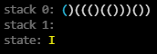
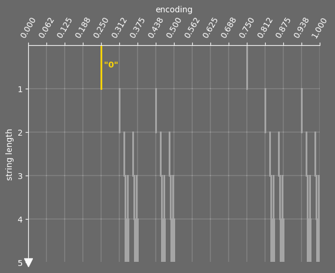
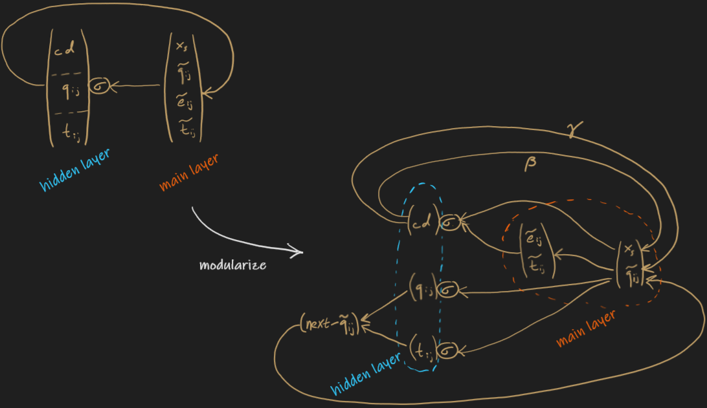

# Siegelmann & Sontag's $p$-Stack Machines

The networks in "On the Computational Power of Neural Nets" 
store internal memory in $p$ stacks instead of a tape.
Here, "stack" is used in the standard sense and has
basic operations of push, pop, peek.

### Encoding binary strings

