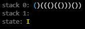
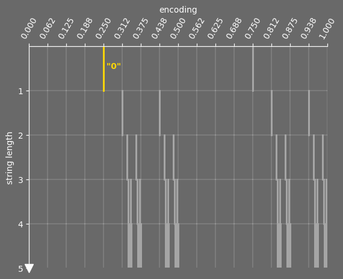

# Siegelmann & Sontag: Neural Nets as Turing Machines

Siegelmann and Sontag proved in 1995 that a fixed recurrent neural network can simulate any Turing machine. Their construction works by encoding the Turing machine tape as numbers stored in the network's hidden state.

This document explains their approach and how to use the implementation in this repo.

---

### The Core Idea: Stacks Instead of a Tape

Rather than operating on a tape directly, Siegelmann & Sontag reformulate the problem using *p-stack machines*. A p-stack machine is equivalent to a Turing machine but stores memory in `p` stacks instead of a tape. Each stack supports three operations: **push**, **pop**, and **peek** (read the top).

For the balanced parentheses problem, two stacks are enough:

<p></p>

The transition function for a p-stack machine takes the current state and the top of each stack as inputs, and outputs the next state and a stack operation for each stack:

```python
# (state, top_of_stack_1, top_of_stack_2) → (next_state, op_stack_1, op_stack_2)
# ops: 'noop', 'push 0', 'push 1', 'pop'
# None = stack is empty; '*' = wildcard (matches any value)

balanced_parentheses_delta_stack = {
    ('*',  '(',  '(') : ('A',  'pop',    'push ('),
    ('*',  '(', None) : ('A',  'pop',    'push ('),
    ('*',  ')',  '(') : ('A',  'pop',       'pop'),
    ('I', None, None) : ('T', 'noop',      'noop'),
    ('A', None, None) : ('T', 'noop',      'noop'),
    # not balanced
    ('*',  ')', None) : ('F', 'noop',      'noop'),
    ('*', None,  '(') : ('F', 'noop',      'noop'),
    # terminal states loop
    ('F',  '*',  '*') : ('F', 'noop',      'noop'),
    ('T',  '*',  '*') : ('T', 'noop',      'noop'),
    ('*',  '*',  ')') : ('F', 'noop',      'noop'),
}
terminal_states = ['T', 'F']
```

---

### Encoding a Stack as a Number

The key mathematical trick is encoding an entire stack as a single rational number using a *Cantor-set encoding*. For a binary stack (symbols 0 and 1), each stack value is encoded as:

$$\delta(a_1 a_2 \cdots a_k) = \sum_{i=1}^{k} \frac{b - 1 + 4p(a_i - 1)}{b^i}$$

where `b` is the base and `p` is a scaling factor. For example with `b=4, p=1/2`:

| Stack contents | Encoded value |
|---|---|
| (empty) | 0 |
| `[0]` | 1/4 |
| `[1]` | 3/4 |
| `[0, 0, 0]` | 21/64 |

<p></p>

The encoding has a crucial property: **push, pop, and peek are all linear functions of the encoded value**. This means the network can manipulate the stack using only linear layers and a saturated ReLU activation $\sigma(x) = \text{clamp}(x, 0, 1)$.

---

### Two Network Versions

The paper describes two constructions:

**Version 4 (`version=4`)** — uses `ceil(log2(|states|)) + 1` layers. Each layer is a stage of the computation. This version is fully implemented and working.

**Version 1 (`version=1`)** — uses a single recurrent layer, operating in "real time" (one network step per Turing machine step). This version is currently in development.

---

### Usage

```python
from turing.ss.simulator import (
    Description, Simulator,
    balanced_parentheses_delta_stack,
    balanced_parentheses_terminal_states,
)

description = Description(
    balanced_parentheses_delta_stack,
    balanced_parentheses_terminal_states,
)

# Version 4 (complete)
tx = Simulator(description, version=4)
tx.simulate("(()())")
```

**Output:** each step prints the state vector. The state index that reads 1.0 is the active state.

```
0 tensor([0., 0., 0.])   ← state I (index 0)
1 tensor([1., 0., 0.])   ← state A (index 1)
2 tensor([1., 0., 0.])
...
7 tensor([0., 0., 1.])   ← state T (balanced)
```

**Defining your own machine:**

The `Description` class accepts any p-stack transition function. Constraints:
- Alphabet must have at most 2 symbols (mapped internally to 0/1)
- `'*'` in a key is a wildcard matching any value
- `None` means the stack is empty

```python
my_delta = {
    # (state, top_stack1, top_stack2) : (next_state, op1, op2)
    ("start", None, None): ("done", "noop", "noop"),
}
description = Description(my_delta, terminal_states=["done"])
tx = Simulator(description, version=4)
```

---

### Architecture

<p></p>

The network state at each step is a vector containing:
- **State part** — one-hot encoding of the current machine state
- **Stack part** — each stack encoded as a single scalar using the Cantor-set encoding

At each step, a *configuration detector* reads the current state and the top of each stack, identifies the matching transition rule, and produces the next state and stack operations. The weights are set analytically via least-squares from the transition function.

The `saturated_relu` σ(x) = max(0, min(1, x)) serves as the nonlinearity throughout, since its behavior on rational inputs is exact.

---

### Further Reading

- [Siegelmann & Sontag (1992)](https://www.sciencedirect.com/science/article/pii/S0022000085710136) — original paper
- `src/turing/ss/networks.py` — `SiegelmannSontag4`, `ConfigurationDetector4`
- `notebooks/siegelmann_sontag.ipynb` — interactive walkthrough
